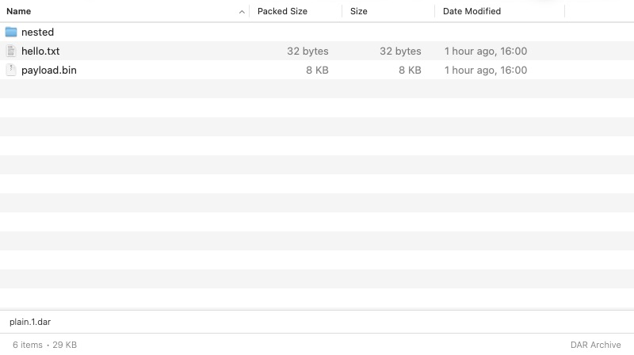
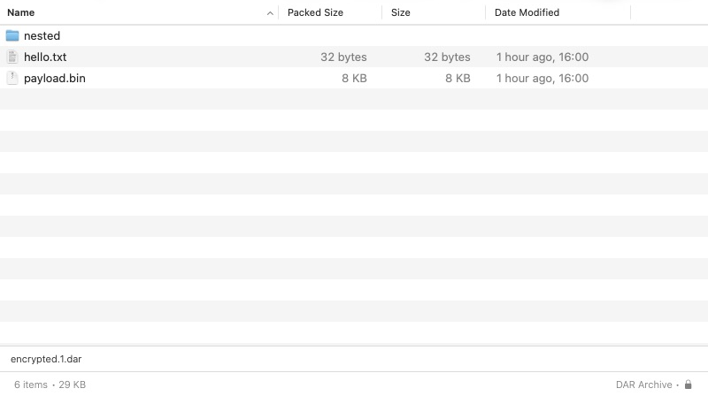

# DAR archives

MacPacker reads DAR archives through a statically linked libdar engine. Opening
any numbered slice (`backup.1.dar`, `backup.004.dar`) resolves its first slice,
asks for access to the containing folder using the existing split-volume flow,
and displays the archive tree. All slices must keep their original names in the
same folder. Whole-archive and selected-file/folder extraction use the existing
MacPacker commands and password resolver.

Supported here: ordinary full archives, numbered and zero-padded slice sets,
password encryption supported by libgcrypt, and gzip, bzip2, xz, LZ4 and Zstandard
compression. Extraction runs on a blocking worker with libdar cancellation;
progress is indeterminate. Neither a DAR executable nor Homebrew is needed by users.

This is an archive reader, not a backup-chain restoration tool. Incremental
entries whose data is absent, deletion records, devices and sockets are rejected
when selected. It does not create DAR archives or apply binary deltas. Optional
LZO, Argon2 and GPG support are not built; archives requiring those features fail
with a libdar error. Ordinary password archives using PBKDF2 are supported.
Quick Look is not registered for DAR because accessing a slice set needs the
app's folder-access interaction.

## Extraction safety

Archive paths, case/Unicode name collisions, symbolic links and non-directory
ancestors are validated before extraction, including on the native archive object
that performs the restore. Data is restored into a private temporary directory
first. Missing slices, bad passwords, corrupt data and cancellation fail before
files are copied into the chosen destination. Existing top-level items are never
overwritten: use an empty folder when a name conflicts. A filesystem failure
while copying to the destination is reported; extraction is not a transaction
against concurrent external changes to that directory.

## Building and dependencies

Run `python3 scripts/build-dar.py` before SwiftPM or Xcode. It downloads archives
listed in `scripts/dar-dependencies.json`, checks their SHA-256 digests, builds
static libraries for both supported Mac architectures, and combines them using
`lipo`. Headers and libraries stay inside `Modules/.build/dar-dependencies`.
Delete that directory for a clean rebuild. The script's completed-build stamp
includes the script and manifest, so changing either rebuilds dependencies.

DAR 2.8.6 / libdar 7.0.5 uses one unconditional runtime test for `sizeof(off_t)`
in its generated configure script. The build changes that one probe to a compile
assertion, allowing an Intel build on Apple silicon without Rosetta. Other
cross-compile checks use upstream's fallbacks. Only `src/libdar` is built and
installed; MacPacker does not ship DAR's command-line tools. The archive source
is checksum-pinned, and no 7-Zip vendored files are modified.

The app's existing Acknowledgements view includes upstream notices for libdar,
libgcrypt, libgpg-error, liblzma, LZ4 and Zstandard. Complete dependency sources
and build instructions are identified by the pinned manifest and this script.

## Verification

`swift test --package-path Modules --filter DarEngineTests` exercises the DAR
fixtures from MacPacker-TestArchives: plain, compressed, encrypted, split and
padded split archives; compares extracted SHA-256 hashes; checks selected-file
and selected-folder extraction, wrong-password retry, dismissal, missing slices,
existing destination content, unsafe paths, extension casing and cancellation.
Run the full suite and build both application schemes before publishing.

### Verified on macOS arm64

Final local checks for this contribution:

```text
swift test --package-path Modules
✔ Test run with 591 tests in 138 suites passed after 119.928 seconds.

swift test --package-path Modules --filter DarEngineTests
✔ Test run with 13 tests in 2 suites passed after 0.389 seconds.

xcodebuild -scheme MacPacker -configuration Release CODE_SIGNING_ALLOWED=NO ONLY_ACTIVE_ARCH=NO build
** BUILD SUCCEEDED **

xcodebuild -scheme "MacPacker Store" -configuration "Release Store" CODE_SIGNING_ALLOWED=NO ONLY_ACTIVE_ARCH=NO build
** BUILD SUCCEEDED **

scripts/check-architectures.sh <Direct app>
10 Mach-O files checked, every one has an arm64 and an x86_64 slice.

scripts/check-architectures.sh <Store app>
5 Mach-O files checked, every one has an arm64 and an x86_64 slice.
```

The native dependency script also completed a clean build for both architectures.
Intel was compiled and linked, not executed on this Apple silicon machine.

Manually exercised the built release app in an isolated copy: opened the plain
DAR fixture, granted its fixture-folder access, browsed its entries, and extracted
it using the toolbar command. All four extracted file hashes matched the fixture
manifest and the empty directory was restored. Opening the encrypted fixture
showed the existing password sheet; a wrong password showed the retry message,
and the public fixture password opened the six entries with the lock indicator.
The temporary review app was removed afterwards; no installed app was replaced.

These are real app screenshots, cropped to exclude the toolbar containing the
computer-use cursor. No archive content or status information was edited.
No existing view layout is changed by this format integration.




