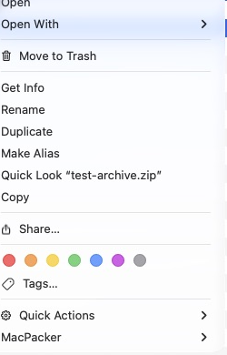

# Issue #275 verification

## Finder on a physical USB drive

Tested on macOS 27 using a mounted FAT32 USB drive. All operations used a disposable test directory; no existing drive files were changed.

An isolated ad-hoc-signed review Finder extension contained the patched binary. The installed MacPacker app remained unchanged and handled the existing extraction/compression URL actions. The review extension was disabled for the before image and enabled for the after image.

| Before: no MacPacker submenu | After: MacPacker submenu available |
| --- | --- |
|  |  |

Screenshots are genuine Finder context-menu crops. The cursor and unrelated windows are outside the crop.

- Right-clicking the existing ZIP fixture on the USB drive showed no MacPacker submenu before the fix and showed extraction/compression actions with the review extension enabled.
- Invoked **Extract Here** through the patched Finder extension. All 3 extracted files matched the fixture ZIP byte-for-byte.
- Invoked MacPacker's **Compress to "test-file.zip"** on a disposable text file. The resulting ZIP contained the original file byte-for-byte.
- Removed the review app, extension registration, and disposable USB directory after verification. Confirmed the original installed Finder extension remained enabled.

## Automated verification

The initial home-only implementation failed 3 assertions across the mounted-volume and refresh regression tests. After the fix:

```text
Test run with 5 tests in 2 suites passed.
```

The full suite passed before adding the two extra sandbox-home/normalization cases; those extra cases passed in the focused run above:

```text
Test run with 580 tests in 138 suites passed after 108.639 seconds.
```

Both MacPacker and MacPacker Store Release builds succeeded with ONLY_ACTIVE_ARCH=NO. The architecture guard checked the resulting bundles:

```text
15 Mach-O files checked, every one has an arm64 and an x86_64 slice.
```

Mount/unmount/rename root replacement is covered by the pure regression tests. Physical hot-plug and rename notifications were not manually exercised; the user's external drive was left mounted throughout testing.
