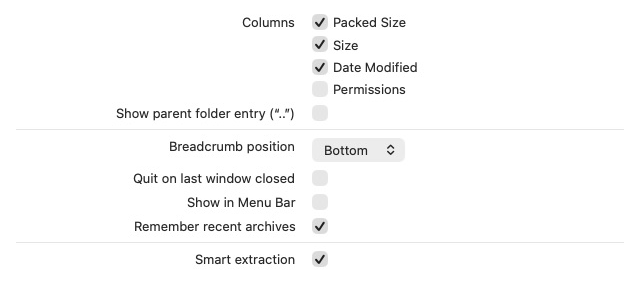
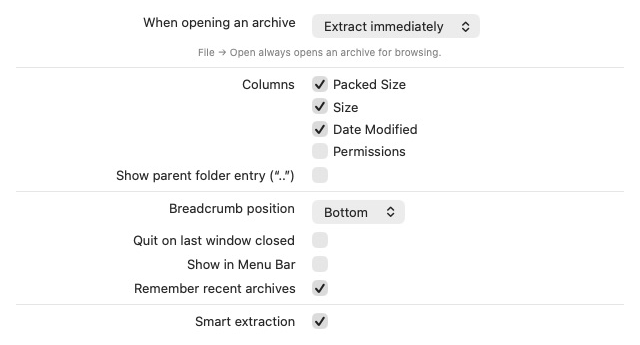

# Issue #280 verification

## Behavior

General settings now offers **When opening an archive → Open in MacPacker / Extract immediately**. Browsing remains the default. Recognized archive files opened through Finder/Open With can extract next to themselves using the existing smart-extraction setting. Explicit in-app opening still browses archives. No Finder extension, URL action, format association, or separate helper app was added.

File-open events can arrive after startup. In extraction mode the launcher is created only for an explicit untitled-document request, rather than eagerly showing it before the archive event. Password/access prompts keep the operation alive through the gap before a progress job exists. When the queue finishes, the existing quit-on-last-window setting is respected if no windows or other extraction jobs remain.

## Manual verification

Tested on macOS 27 with an isolated, ad-hoc-signed review app and existing public TestArchives fixtures copied into disposable folders. The installed customized MacPacker was not replaced. Review bundle identifiers were changed only in the test copy; its extensions were removed to avoid duplicate Finder menus.

- The setting initially displayed **Open in MacPacker**. Changed it to **Extract immediately** and verified persistence across restarts.
- Cold Finder/Open With launch of the plain ZIP extracted all 3 files; every file matched the fixture ZIP byte-for-byte.
- The first implementation exposed a startup-order bug (welcome/launcher before the late file event). After correction, lifecycle logs showed launch finishing and then the archive-open event, without creating a launcher/welcome window. Explicitly reactivating the app afterward still opened the normal interface.
- An encrypted-header 7z displayed a standalone password panel. An incorrect public-fixture password produced the retry message; the correct fixture password extracted all 3 files byte-for-byte.
- Cancelled the password prompt on a fresh encrypted fixture: no extracted output, source preserved, process terminated with quit-on-last-window enabled.
- Opened two encrypted archives together. Only the first password prompt appeared; cancelling it advanced to the second. The second archive extracted correctly after password entry, while the cancelled first archive produced no output.
- Explicitly launched the app and used **Open Archive** (the same `openArchiveUsingOpenPanel` path as File → Open) while extraction mode remained enabled: the ZIP opened in the archive browser.

The UI-control tool can itself send a reopen event when inspecting an app with no visible windows. Such a later explicit reopen was distinguished from the original Finder launch using lifecycle logs.

## Screenshots

These are genuine screenshots cropped to remove the pointer and unrelated content.

| Before | After |
| --- | --- |
|  |  |


## Automated verification

The baseline extraction-routing test failed before the feature was enabled. The final 3 focused tests pass, covering default/unknown stored values, opt-in file-only routing, and launch-window policy.

```text
Test run with 580 tests in 138 suites passed after 122.913 seconds.
```

Both final Direct and Store universal Release builds succeeded. Architecture verification:

```text
15 Mach-O files checked, every one has an arm64 and an x86_64 slice.
```

The initial Store build caught an empty generated localization key. The picker was corrected and both builds rerun. New catalog entries come from Xcode-generated strings data, with the repository's build-time catalog normalization applied; no translations were added manually to the string catalog.

Scope: uses the existing extraction engine, smart-folder rules, permissions, and progress reporting. It does not introduce new overwrite/merge behavior or depend on merging #285. The standalone password-panel pattern is reused from that work. The installed app and its preferences remain unchanged.
